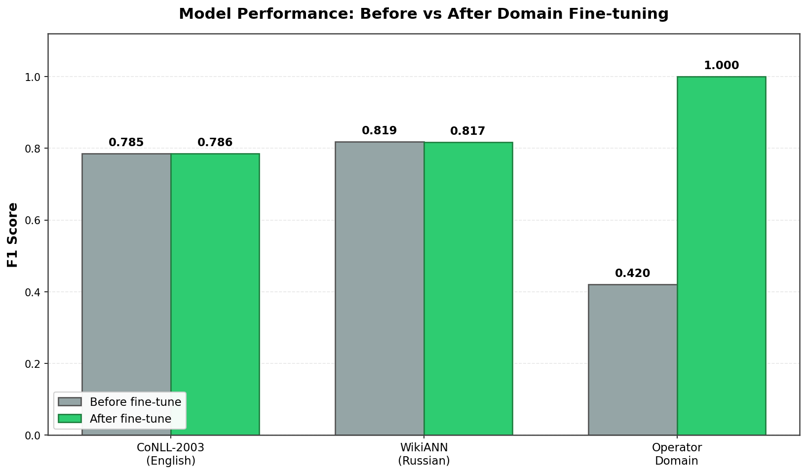
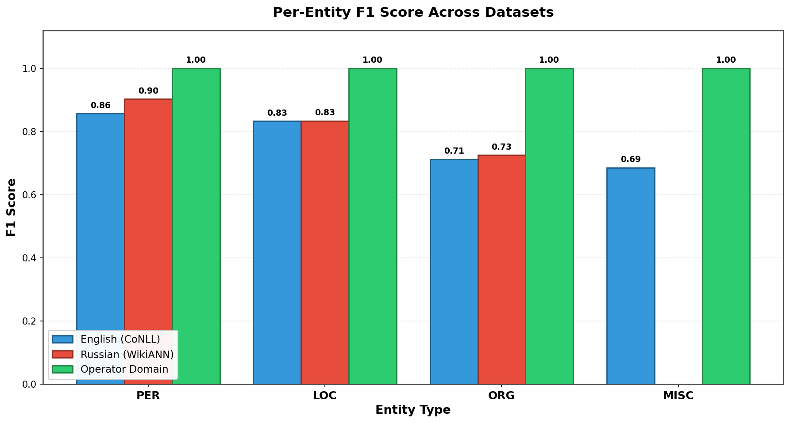
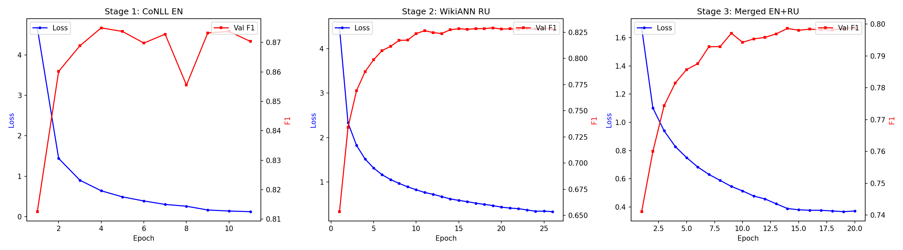
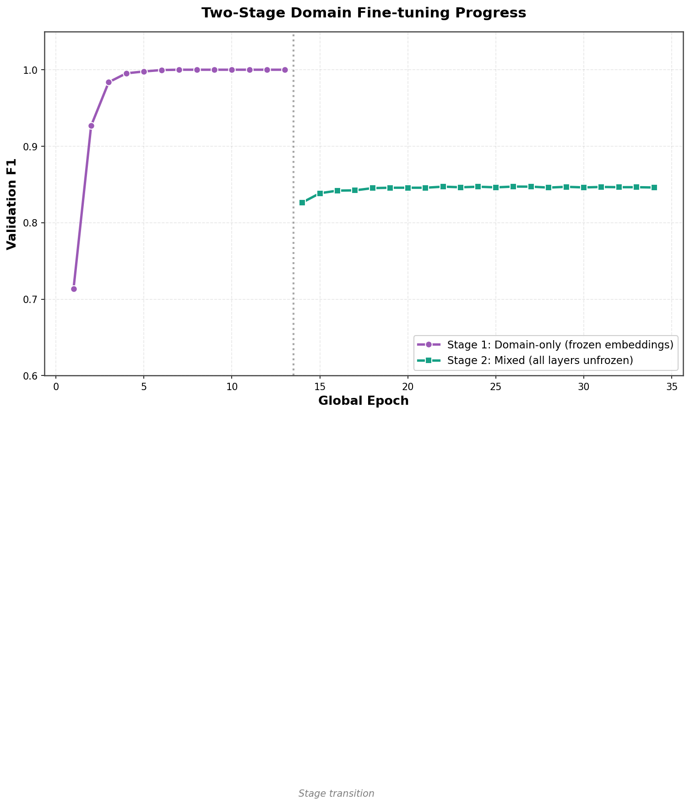
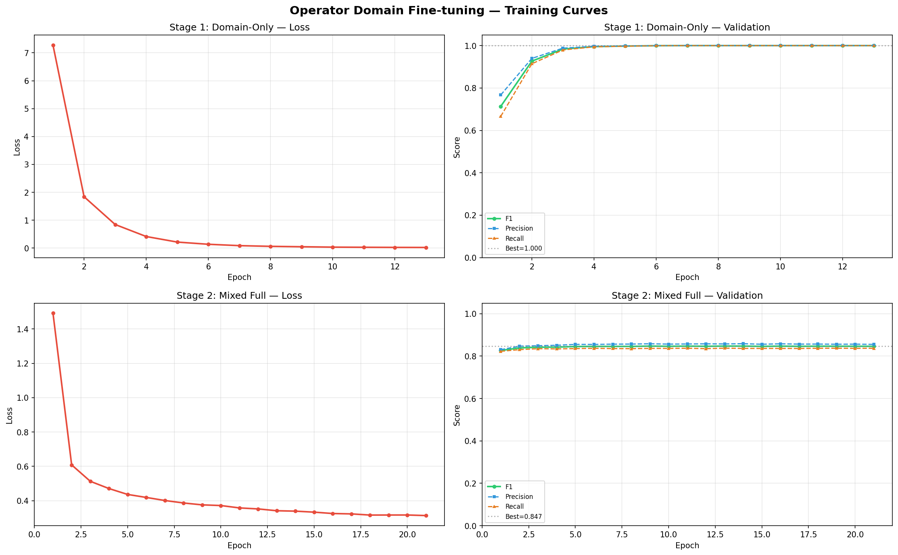

# Multilingual NER from Scratch — BiLSTM-CRF

<p align="center">
  
  
  
  
  
</p>

<p align="center">
  <strong>A production-ready Named Entity Recognition system built entirely from scratch in PyTorch.</strong><br/>
  No HuggingFace Transformers. No pretrained BERT. Pure BiLSTM-CRF with a hand-written CRF layer.
</p>

<p align="center">
  <a href="#-results">Results</a> •
  <a href="#-architecture">Architecture</a> •
  <a href="#-quick-start">Quick Start</a> •
  <a href="#-operator-domain-fine-tuning">Domain Fine-tuning</a> •
  <a href="#-rag-integration">RAG</a>
</p>

---

## Overview

This project implements a **multilingual NER pipeline** for English and Russian, designed to power entity extraction inside an operator chatbot RAG system. Every component — from the CRF forward algorithm to the Viterbi decoder — is written from scratch. After base training on public datasets, the model is fine-tuned on a synthetic telecom operator domain and reaches **F1 = 1.00** on domain entities while preserving general-purpose performance.

### Entity Types

| Tag | Description | Example |
|-----|-------------|---------|
| `PER` | Person names | *John Smith*, *Иван Петров* |
| `ORG` | Organizations | *Google*, *МегаФон* |
| `LOC` | Locations | *London*, *Москва* |
| `MISC` | Tariffs, services, USSD codes | *Unlimited*, *\*100#* |

---

## Results

### Headline Numbers

<p align="center">
  
</p>

| Metric | English (CoNLL-2003) | Russian (WikiANN) | Operator Domain |
|--------|:-------------------:|:-----------------:|:---------------:|
| **F1** | **0.786** | **0.817** | **1.000** |
| Precision | 0.811 | 0.824 | 1.000 |
| Recall | 0.762 | 0.811 | 1.000 |

The domain fine-tune **preserves** the general cross-lingual skill of the base model — English and Russian scores actually *improve slightly* after the mixed-data second stage, while domain entities jump to perfect recognition.

### Per-Entity Breakdown

<p align="center">
  
</p>

#### English (CoNLL-2003 test)
| Entity | Precision | Recall | F1 | Support |
|--------|:---------:|:------:|:--:|:-------:|
| PER | 0.909 | 0.811 | **0.857** | 1,617 |
| LOC | 0.842 | 0.825 | **0.833** | 1,668 |
| ORG | 0.721 | 0.704 | **0.712** | 1,661 |
| MISC | 0.738 | 0.640 | **0.685** | 702 |

#### Russian (WikiANN test)
| Entity | Precision | Recall | F1 | Support |
|--------|:---------:|:------:|:--:|:-------:|
| PER | 0.908 | 0.899 | **0.903** | 3,543 |
| LOC | 0.839 | 0.829 | **0.834** | 4,560 |
| ORG | 0.737 | 0.715 | **0.726** | 4,074 |

#### Operator Domain (synthetic test)
| Entity | Precision | Recall | F1 | Support |
|--------|:---------:|:------:|:--:|:-------:|
| MISC | 1.000 | 1.000 | **1.000** | 1,484 |
| ORG  | 1.000 | 1.000 | **1.000** |   303 |
| PER  | 1.000 | 1.000 | **1.000** |   289 |
| LOC  | 1.000 | 1.000 | **1.000** |   247 |

### Training Curves

Base 3-stage training (CoNLL → WikiANN → Merged):

<p align="center">
  
</p>

2-stage domain fine-tune (frozen-embedding warmup → full mixed unfreeze):

<p align="center">
  
</p>

<p align="center">
  
</p>

### Training Pipeline

```
┌──────────────────────────────────────────────────────────────────┐
│                     BASE TRAINING (3 STAGES)                     │
├──────────────────────────────────────────────────────────────────┤
│  Stage 1: CoNLL-2003 (EN)     ──►  train from scratch            │
│  Stage 2: WikiANN (RU)        ──►  resume, lr=1e-4               │
│  Stage 3: Merged (EN + RU)    ──►  resume, lr=1e-4               │
├──────────────────────────────────────────────────────────────────┤
│                 DOMAIN FINE-TUNE (2 STAGES)                      │
├──────────────────────────────────────────────────────────────────┤
│  Stage 1: Domain only         ──►  lr=5e-5, freeze word emb      │
│                                    val F1 = 1.0000 @ epoch 7     │
│  Stage 2: Domain + EN + RU    ──►  lr=1e-5, unfreeze all         │
│                                    val F1 = 0.8472 (preserves)   │
└──────────────────────────────────────────────────────────────────┘
```

---

## Architecture

```
┌─────────────────────────────────────────────────────────────┐
│                      Input Sentence                         │
│              "John works at Google in London"               │
└───────────────┬─────────────────────────────────────────────┘
                │
    ┌───────────▼───────────┐
    │   Tokenize + Encode   │
    └───────────┬───────────┘
                │
  ┌─────────────▼─────────────────────────────────────┐
  │              Embedding Layer (366-dim)             │
  │  ┌────────────┐  ┌────────────┐  ┌──────────────┐ │
  │  │  FastText   │  │  CharCNN   │  │  Language ID │ │
  │  │  Word Emb   │  │  Features  │  │  Embedding   │ │
  │  │  (300-dim)  │  │  (50-dim)  │  │   (16-dim)   │ │
  │  └────────────┘  └────────────┘  └──────────────┘ │
  └───────────────────────┬───────────────────────────┘
                          │
  ┌───────────────────────▼───────────────────────────┐
  │           BiLSTM Encoder (2 layers)               │
  │         hidden=256 × 2 directions = 512           │
  └───────────────────────┬───────────────────────────┘
                          │
  ┌───────────────────────▼───────────────────────────┐
  │              Linear Projection → 9 tags           │
  └───────────────────────┬───────────────────────────┘
                          │
  ┌───────────────────────▼───────────────────────────┐
  │               CRF Layer (from scratch)            │
  │  • Forward algorithm (log-partition via logsumexp)│
  │  • Viterbi decoding (backpointer tracing)         │
  │  • Learnable transition matrix                    │
  └───────────────────────┬───────────────────────────┘
                          │
    ┌─────────────────────▼─────────────────────────┐
    │  B-PER  O    O   B-ORG  O   B-LOC             │
    │  John  works at  Google in  London            │
    └───────────────────────────────────────────────┘
```

---

## Project Structure

```
.
├── configs/
│   └── config.yaml              # All hyperparameters
│
├── data/
│   ├── download_datasets.py     # CoNLL-2003 + WikiANN downloader
│   ├── generate_synthetic.py    # Operator domain synthetic data
│   ├── preprocess.py            # Dataset processing + collation
│   └── vocab.py                 # Word/Char vocabularies + TagMap
│
├── embeddings/
│   └── load_fasttext.py         # FastText EN+RU download + merge
│
├── model/
│   ├── char_cnn.py              # Character-level CNN
│   ├── embedding_layer.py       # Word + Char + Lang embeddings
│   ├── bilstm.py                # Bidirectional LSTM encoder
│   ├── crf.py                   # CRF (forward algo + Viterbi)
│   └── ner_model.py             # Full BiLSTM-CRF model
│
├── training/
│   ├── train.py                 # Main training loop
│   ├── finetune_domain.py       # Operator domain fine-tuning
│   ├── evaluate.py              # Evaluation with seqeval
│   └── predict.py               # Inference + entity extraction
│
├── evaluation/
│   ├── run_evaluation.py        # Full evaluation suite
│   ├── baselines.py             # Majority / Random / Frequency
│   └── compare.py               # Model vs baseline comparison
│
├── integration/
│   └── rag_pipeline.py          # RAG query enrichment pipeline
│
├── notebooks/
│   ├── train_kaggle.ipynb             # Base 3-stage training
│   └── finetune_domain_kaggle.ipynb   # 2-stage domain fine-tune
│
└── results/
    ├── training_results.json          # Base training metrics
    ├── domain_finetune_results.json   # Fine-tune metrics
    ├── training_curves.png            # Base loss + F1 plots
    ├── domain_finetune_curves.png     # Fine-tune loss + F1 plots
    ├── finetune_progress.png          # 2-stage fine-tune progress
    ├── model_comparison.png           # Before vs after fine-tune
    └── per_entity_comparison.png      # Per-entity F1 across sets
```

---

## Quick Start

### 1. Install Dependencies

```bash
pip install torch>=2.0 datasets numpy seqeval pyyaml matplotlib
```

### 2. Download Data + Build Vocab

```bash
python data/download_datasets.py --output_dir data/raw
python data/vocab.py --raw_dir data/raw --output_dir data/processed
```

### 3. Download FastText Embeddings

```bash
python embeddings/load_fasttext.py --lang both --output_dir embeddings/vectors
```

### 4. Preprocess

```bash
python data/preprocess.py --raw_dir data/raw --vocab_dir data/processed --output_dir data/processed
```

### 5. Train (3 Stages)

```bash
# Stage 1: English
python training/train.py \
  --train_data data/processed/conll2003_train.pt \
  --val_data data/processed/conll2003_validation.pt \
  --ckpt_dir checkpoints

# Stage 2: Russian fine-tune
python training/train.py \
  --train_data data/processed/wikiann_ru_train.pt \
  --val_data data/processed/wikiann_ru_validation.pt \
  --ckpt_dir checkpoints \
  --resume checkpoints/best_model.pt \
  --lr 0.0001

# Stage 3: Merged
python training/train.py \
  --train_data data/processed/merged_train.pt \
  --val_data data/processed/merged_validation.pt \
  --ckpt_dir checkpoints \
  --resume checkpoints/best_model.pt \
  --lr 0.0001
```

### 6. Predict

```bash
python training/predict.py \
  --checkpoint checkpoints/merged_best.pt \
  --input "John Smith works at Google in London"
```

Output:
```
  John                 B-PER
  Smith                I-PER
  works                O
  at                   O
  Google               B-ORG
  in                   O
  London               B-LOC

Extracted entities:
  [PER] John Smith
  [ORG] Google
  [LOC] London
```

---

## Operator Domain Fine-tuning

The fine-tune uses a **2-stage strategy** to get perfect domain scores without sacrificing cross-lingual knowledge:

1. **Stage 1 — Domain warm-up** (frozen word embeddings, `lr=5e-5`): the model quickly memorizes the new telecom entities (USSD codes, tariffs, services) without disturbing pretrained word vectors.
2. **Stage 2 — Mixed full fine-tune** (all layers unfrozen, `lr=1e-5`): the model is trained on a mix of domain data + CoNLL-2003 + WikiANN-RU to lock in domain knowledge *and* fight catastrophic forgetting.

```bash
# Generate synthetic data
python data/generate_synthetic.py --output_dir data/raw/operator_domain --n_per_template 300

# Fine-tune from merged checkpoint
python training/finetune_domain.py \
  --checkpoint checkpoints/merged_best.pt \
  --domain_data data/raw/operator_domain \
  --lr 5e-5 \
  --epochs 25 \
  --freeze_embeddings
```

After fine-tuning, the model recognizes operator-specific entities:

```
Input:  "Activate the Unlimited tariff by dialing *100#"
Output: [MISC] Unlimited     (tariff name)
        [MISC] *100#         (USSD code)
```

```
Input:  "Подключите тариф Безлимит набрав *100#"
Output: [MISC] Безлимит      (тариф)
        [MISC] *100#         (USSD код)
```

---

## RAG Integration

Use the NER engine to enrich search queries for a RAG pipeline:

```python
from integration.rag_pipeline import create_pipeline

pipeline = create_pipeline(
    config_path="configs/config.yaml",
    checkpoint_path="checkpoints/domain_finetuned_best.pt",
    vocab_dir="data/processed",
)

result = pipeline.build_retrieval_context(
    "How much does the Unlimited plan cost in Moscow?"
)
```

```json
{
  "query": "How much does the Unlimited plan cost in Moscow? [MISC: Unlimited] [LOC: Moscow]",
  "filters": {
    "MISC": ["Unlimited"],
    "LOC": ["Moscow"]
  },
  "boost_terms": ["Unlimited", "Moscow"],
  "metadata": {
    "language": "en",
    "detected_entities": [...]
  }
}
```

---

## Training on Kaggle

Both training notebooks are ready to run on Kaggle T4 × 2 GPUs.

**Base training** — `notebooks/train_kaggle.ipynb`:
1. Upload to Kaggle, enable **GPU T4 × 2** and **Internet**
2. Run All — takes ~2-3 hours for all 3 base stages

**Domain fine-tune** — `notebooks/finetune_domain_kaggle.ipynb`:
1. Upload `merged_best.pt`, vocab JSONs, and FastText `.npy` as a Kaggle model/dataset
2. Run All — takes ~2-3 hours for both fine-tune stages
3. Produces `domain_finetuned_best.pt` + `stage2_mixed_best.pt`

---

## Model Details

| Component | Details |
|-----------|---------|
| Word Embeddings | FastText 300-dim (EN + RU, 500K each) |
| Char Embeddings | CNN with 50 filters, kernel=3, ReLU + MaxPool |
| Language Embeddings | 16-dim learnable (EN=0, RU=1) |
| Input Dimension | 300 + 50 + 16 = **366** |
| Encoder | 2-layer BiLSTM, hidden=256 per direction |
| CRF | Full from-scratch: forward algo + Viterbi decode |
| Tags | 9 (BIO scheme): O, B/I-PER, B/I-ORG, B/I-LOC, B/I-MISC |
| Optimizer | AdamW (lr=1e-3 base → 5e-5 / 1e-5 fine-tune) |
| Scheduler | ReduceLROnPlateau (patience=3) |
| Regularization | Dropout=0.5, weight_decay=1e-4, grad_clip=5.0 |
| Mixed Precision | FP16 with GradScaler on CUDA |
| Total Parameters | ~3.5M |

---

## Datasets

| Dataset | Language | Train | Val | Test | Source |
|---------|----------|------:|----:|-----:|--------|
| CoNLL-2003 | English | 14,041 | 3,250 | 3,453 | [HuggingFace](https://huggingface.co/datasets/conll2003) |
| WikiANN | English | 20,000 | 10,000 | 10,000 | [HuggingFace](https://huggingface.co/datasets/wikiann) |
| WikiANN | Russian | 20,000 | 10,000 | 10,000 | [HuggingFace](https://huggingface.co/datasets/wikiann) |
| Operator Domain | EN + RU | ~12,000 | ~1,500 | ~1,500 | synthetic (`generate_synthetic.py`) |

---

## From-Scratch Highlights

This project deliberately avoids high-level NLP libraries to demonstrate deep understanding:

- **CRF Forward Algorithm** — log-space partition function computation using `logsumexp` for numerical stability, with proper masking for variable-length sequences
- **Viterbi Decoding** — backpointer-based optimal path finding, handling batched sequences with different lengths
- **Character CNN** — Conv1D over character embeddings with max-pooling to capture morphological features (prefixes, suffixes, capitalization patterns)
- **Embedding Fusion** — concatenation of word-level (FastText), character-level (CNN), and language-level (learned) representations
- **Pack/Pad Sequences** — proper handling of variable-length inputs with `pack_padded_sequence` / `pad_packed_sequence`
- **2-Stage Domain Adaptation** — frozen-embedding warm-up followed by mixed-data full fine-tune, preventing catastrophic forgetting

---

## License

MIT
